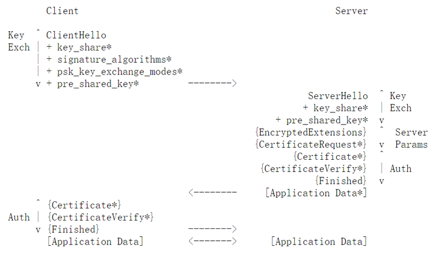

## **Part 1-简介**

**TLS1.3与之前的协议有较大差异**

SSL/TLS协议为网络通信提供了以下两种功能：

1. 建立一个安全的连接：对其中传输的数据提供加密保护，防止被中间人嗅探到可见明文；对数据提供完整性校验，防止传输的数据被中间人修改。
2. 建立一个可信的连接：对连接双方的实体提供身份认证。

上述功能在以往的TLS协议中是这样实现的：

- 加密：使用对称加密算法（块加密、流加密）加密会话数据，密钥交换主要通过非对称算法加密会话过程中使用的对称密钥传递给对方来实现（RSA）。从TLS 1.0起引入了DH密钥交换算法作为另一种可选的密钥交换算法。
- 完整性校验：使用MAC对发送的报文进行完整性校验计算，先计算MAC再加密。在TLS 1.2中引入了更具有安全性的AEAD算法（同时完成加密和完整性校验）作为一个加密机制的备选选项 。
- 身份认证：所有的身份认证都基于证书公钥体系完成。

因为RSA密钥交换过程安全性完全依赖于服务器私钥的安全性，TLS 1.3彻底废弃了RSA密钥交换算法。
因为先计算MAC再加密的方法存在相当的安全缺陷，TLS 1.3废弃了使用MAC的块加密和流加密机制，仅采用AEAD类对称加密算法作为唯一的加密选项。
此外，TLS 1.3引入了一种新的密钥协商机制——PSK。

其他新协议大的改变还包括：
\- 支持0-RTT数据传输
\- 废弃了3DES、RC4、AES-CBC等加密组件。废弃了SHA1、MD5等哈希算法。
\- 不再允许对加密报文进行压缩、不再允许双方发起重协商，密钥的改变不再需要发送change_cipher_spec报文给对方。
\- 握手阶段的报文可见明文大大减少。

对比以往的协议RFC中不足一页的Major Differences from Previous。TLS 1.3确实可以称得上是向前的一大步。

**TLS 1.3包括3个子协议——alert、handshake、record**

handshake协议负责协商使用的TLS版本、加密算法、哈希算法、密钥材料和其他与通信过程有关的信息，对服务器进行身份认证，对客户端进行可选的身份认证，最后对整个握手阶段信息进行完整性校验以防范中间人攻击，是整个TLS协议的核心。
record协议负责对接收到的报文进行加密解密，将其分片为合适的长度后转发给其他协议层。
alert协议负责处理消息传输与握手阶段中的异常情况。
此前的协议中还定义了一个子协议change_cipher_spec来决定何时对传递的数据进行加密，TLS 1.3取消了这一机制，密钥的使用和改变随着服务器和客户端状态的改变自然进行。

## **Part 2-新的术语**

**PSK（pre_shared_key）——新的密钥交换暨身份认证机制**

1. 0-RTT：客户端和服务端的一次交互（客户端发一个报文，服务端回应一个报文）叫做一个RTT，TLS 1.2普遍采用2-RTT的握手过程，服务器延迟明显。因此TLS 1.3引入了一种0-RTT的机制，即在刚开始TLS密钥协商的时候，就能附送一部分经过加密的数据传递给对方。
2. 为了实现0-RTT，需要双方在刚开始建立连接的时候就已经持有一个对称密钥，这个密钥在TLS 1.3中称为PSK（pre_shared_key）。
3. PSK是TLS 1.2中的rusumption机制的一个升级，TLS握手结束后，服务器可以发送一个NST（new_session_ticket）的报文给客户端，该报文中记录PSK的值、名字和有效期等信息，双方下一次建立连接可以使用该PSK值作为初始密钥材料。
4. 因为PSK是从以前建立的安全信道中获得的，只要证明了双方都持有相同的PSK，不再需要证书认证，就可以证明双方的身份，因此，PSK也是一种身份认证机制。

> ps: 0-RTT的实现有一定的安全缺陷，自身没有抗重放攻击的机制
> 在TLS 1.3草案中提出了几个对性能消耗比较大的可能的解决方法，感兴趣的话可以找来读一读。

**HKDF（HMAC_based_key_derivation_function）——新的密钥导出函数**

1. 经过密钥协商得出来的密钥材料因为随机性可能不够，协商的过程能被攻击者获知，需要使用一种密钥导出函数来从初始密钥材料（PSK或者DH密钥协商计算出来的key）中获得安全性更强的密钥。
2. HKDF正是TLS 1.3中所使用的这样一个算法，使用协商出来的密钥材料和握手阶段报文的哈希值作为输入，可以输出安全性更强的新密钥。
3. HKDF包括extract_then_expand的两阶段过程。extract过程增加密钥材料的随机性，在TLS 1.2中使用的密钥导出函数PRF实际上只实现了HKDF的expand部分，并没有经过extract，而直接假设密钥材料的随机性已经符合要求。

**AEAD（Authenticated_Encrypted_with_associated_data）——唯一保留的加密方式**

1. TLS协议的最终目的是协商出会话过程使用的对称密钥和加密算法，双方最终使用该密钥和对称加密算法对报文进行加密。
2. AEAD将完整性校验和数据加密两种功能集成在同一算法中完成，是TLS 1.3中唯一支持的加密方式。TLS 1.2还支持流加密和CBC分组模式的块加密方法，使用MAC来进行完整性校验数据，这两种方式均被证明有一定的安全缺陷。
3. 但是有[研究表明](https://link.zhihu.com/?target=http%3A//www.isg.rhul.ac.uk/~kp/TLS-AEbounds.pdf)AEAD也有一定局限性：使用同一密钥加密的明文达到一定长度后，就不能再保证密文的安全性。因此，TLS 1.3中引入了密钥更新机制，一方可以（通常是服务器）向另一方发送Key Update（KU）报文，对方收到报文后对当前会话密钥再使用一次HKDF，计算出新的会话密钥，使用该密钥完成后续的通信。

## **Part 3-Handshake子协议**

**TLS 1.3完整握手工作流**

- +表示该报文中值得注意的extension
- \* 表示该内容也可能不被发送
- {} 表示该内容使用handshake_key加密
- [] 表示该内容使用application_key加密

**TLS 1.3握手执行步骤**

TLS 1.3握手按照严格的顺序发送不同的报文，各个报文包含标识自己种类的数据以及其他与握手协商有关的扩展数据（extension）。任何时候收到不按顺序发出的报文种类，服务器会报错，并转交给alert协议层处理。
一个正常情况下的TLS 1.3握手应该按照以下顺序组织报文：

- 客户端发送Client Hello（CH）报文，包含有关密钥协商以及其他与TLS连接建立有关的扩展给服务端。
- 服务端发送Server Hello（SH）报文，包含有关密钥协商的扩展返还给客户端，双方根据CH和SH的协商结果可以得出密钥材料。
- 如果客户端发送的CH报文不满足服务端的需要（如：不包含服务端支持的DH组件），服务端会发送一个Hello Retry Request报文给客户端，要求客户端重新发送符合要求的CH报文。
- 利用密钥材料和前两个报文的哈希值，使用HKDF可以计算出一个handshake_key，此后握手阶段的信息受该密钥保护。
- 服务端发送Encypted Extension（EE）报文，包含其他与密钥协商无关的扩展数据给客户端。
- 如果使用公钥证书进行身份认证，服务端发送Certificate报文（传递自己的证书信息），和Certificate Verify(CV)报文（使用自己的证书私钥对之前的报文进行HMAC签名证明自己持有该证书）给客户端。
- 如果需要对客户端身份进行认证，服务端还需要发送Certificate Request（CR）报文给对方请求客户端发送证书。
- 服务端发送Finished报文。表明服务端到客户端信道的握手阶段结束，理论上不得再由该信道发送任何握手报文。
- 如果客户端收到了服务端的CR报文，返回自己的Certificate报文和CV报文。
- 客户端发送Finished报文，表明握手阶段结束，可以正式开始会话通讯。Finished报文使用会话密钥对上述所有握手信息进行HMAC签名，校验签名可以检验握手阶段的完整性，也可以验证双方是否协商出了一致的密钥。

所有握手阶段的报文都是由record协议层加解密、分片、填充、转发的。
在这个过程中，如果发生了任何错误（如：服务端证书验证失败、完整性校验错误），则会发送一个alert报文，转交给alert协议层进行错误处理。

**其他没有提及到的报文种类**

除了正常的情况之外，还有其他一些报文可能出现在握手过程中。

1. **用来传递PSK键值对信息的New Session Ticket（NST）报文**： 之前也提到过，NST报文在连接建立后（即客户端发送完Finished报文后），由服务端发送给客户端，包含PSK初始值和PSK名字、有效期、用途限定等信息，双方会在协商完毕后计算application_key的同时计算出一个resumption_key，使用resumption_key与PSK初始值做HKDF计算才正式得到真正的PSK值，用于下一次TLS连接的建立。
2. **负责更新密钥以保证AEAD安全性的Key Update(KU)报文**。
3. **用来实现0-RTT数据传输的Early Data（ED）报文**： 如果使用了PSK协商密钥，可以利用双方都持有的PSK计算出一个early_key，使用该key在发送CH报文之后客户端就可以发送加了密的应用数据（即ED）与服务端进行通讯，ED的发送与其他握手报文独立，即服务端不用等待接收到ED之后再向客户端发送SH，但是客户端一旦受到服务端发送的Finished报文，必须立即结束ED的发送，而转而发送一个**End Of Early Data报文**给服务端。除此之外，客户端也可以在early data正常发送完毕之后，发送End Of Early Data结束ED，而不需要等待收到服务端的Finished报文。

TLS 1.3定义了12种握手报文

TLS 1.3握手按照严格的顺序发送不同的报文，各个报文包含标识自己种类的数据以及其他与握手协商有关的扩展数据（extension）。任何时候收到不按顺序发出的报文种类，服务器会报错，并转交给alert协议层处理。
一个正常情况下的TLS 1.3握手应该按照以下顺序组织报文：

- 客户端发送Client Hello（CH）报文，包含有关密钥协商以及其他与TLS连接建立有关的扩展给服务端。
- 服务端发送Server Hello（SH）报文，包含有关密钥协商的扩展返还给客户端，双方根据CH和SH的协商结果可以得出密钥材料。
- 如果客户端发送的CH报文不满足服务端的需要（如：不包含服务端支持的DH组件），服务端会发送一个Hello Retry Request报文给客户端，要求客户端重新发送符合要求的CH报文。
- 利用密钥材料和前两个报文的哈希值，使用HKDF可以计算出一个handshake_key，此后握手阶段的信息受该密钥保护。
- 服务端发送Encypted Extension（EE）报文，包含其他与密钥协商无关的扩展数据给客户端。
- 如果使用公钥证书进行身份认证，服务端发送Certificate报文（传递自己的证书信息），和Certificate Verify(CV)报文（使用自己的证书私钥对之前的报文进行HMAC签名证明自己持有该证书）给客户端。
- 如果需要对客户端身份进行认证，服务端还需要发送Certificate Request（CR）报文给对方请求客户端发送证书。
- 服务端发送Finished报文。表明服务端到客户端信道的握手阶段结束，理论上不得再由该信道发送任何握手报文。
- 如果客户端收到了服务端的CR报文，返回自己的Certificate报文和CV报文。
- 客户端发送Finished报文，表明握手阶段结束，可以正式开始会话通讯。Finished报文使用会话密钥对上述所有握手信息进行HMAC签名，校验签名可以检验握手阶段的完整性，也可以验证双方是否协商出了一致的密钥。

所有握手阶段的报文都是由record协议层加解密、分片、填充、转发的。
在这个过程中，如果发生了任何错误（如：服务端证书验证失败、完整性校验错误），则会发送一个alert报文，转交给alert协议层进行错误处理。

**其他没有提及到的报文种类**

除了正常的情况之外，还有其他一些报文可能出现在握手过程中。

1. **用来传递PSK键值对信息的New Session Ticket（NST）报文**： 之前也提到过，NST报文在连接建立后（即客户端发送完Finished报文后），由服务端发送给客户端，包含PSK初始值和PSK名字、有效期、用途限定等信息，双方会在协商完毕后计算application_key的同时计算出一个resumption_key，使用resumption_key与PSK初始值做HKDF计算才正式得到真正的PSK值，用于下一次TLS连接的建立。
2. **负责更新密钥以保证AEAD安全性的Key Update(KU)报文**。
3. **用来实现0-RTT数据传输的Early Data（ED）报文**： 如果使用了PSK协商密钥，可以利用双方都持有的PSK计算出一个early_key，使用该key在发送CH报文之后客户端就可以发送加了密的应用数据（即ED）与服务端进行通讯，ED的发送与其他握手报文独立，即服务端不用等待接收到ED之后再向客户端发送SH，但是客户端一旦受到服务端发送的Finished报文，必须立即结束ED的发送，而转而发送一个**End Of Early Data报文**给服务端。除此之外，客户端也可以在early data正常发送完毕之后，发送End Of Early Data结束ED，而不需要等待收到服务端的Finished报文。

TLS 1.3定义了12种握手报文

TLS 1.3握手按照严格的顺序发送不同的报文，各个报文包含标识自己种类的数据以及其他与握手协商有关的扩展数据（extension）。任何时候收到不按顺序发出的报文种类，服务器会报错，并转交给alert协议层处理。
一个正常情况下的TLS 1.3握手应该按照以下顺序组织报文：

- 客户端发送Client Hello（CH）报文，包含有关密钥协商以及其他与TLS连接建立有关的扩展给服务端。
- 服务端发送Server Hello（SH）报文，包含有关密钥协商的扩展返还给客户端，双方根据CH和SH的协商结果可以得出密钥材料。
- 如果客户端发送的CH报文不满足服务端的需要（如：不包含服务端支持的DH组件），服务端会发送一个Hello Retry Request报文给客户端，要求客户端重新发送符合要求的CH报文。
- 利用密钥材料和前两个报文的哈希值，使用HKDF可以计算出一个handshake_key，此后握手阶段的信息受该密钥保护。
- 服务端发送Encypted Extension（EE）报文，包含其他与密钥协商无关的扩展数据给客户端。
- 如果使用公钥证书进行身份认证，服务端发送Certificate报文（传递自己的证书信息），和Certificate Verify(CV)报文（使用自己的证书私钥对之前的报文进行HMAC签名证明自己持有该证书）给客户端。
- 如果需要对客户端身份进行认证，服务端还需要发送Certificate Request（CR）报文给对方请求客户端发送证书。
- 服务端发送Finished报文。表明服务端到客户端信道的握手阶段结束，理论上不得再由该信道发送任何握手报文。
- 如果客户端收到了服务端的CR报文，返回自己的Certificate报文和CV报文。
- 客户端发送Finished报文，表明握手阶段结束，可以正式开始会话通讯。Finished报文使用会话密钥对上述所有握手信息进行HMAC签名，校验签名可以检验握手阶段的完整性，也可以验证双方是否协商出了一致的密钥。

所有握手阶段的报文都是由record协议层加解密、分片、填充、转发的。
在这个过程中，如果发生了任何错误（如：服务端证书验证失败、完整性校验错误），则会发送一个alert报文，转交给alert协议层进行错误处理。

**其他没有提及到的报文种类**

除了正常的情况之外，还有其他一些报文可能出现在握手过程中。

1. **用来传递PSK键值对信息的New Session Ticket（NST）报文**： 之前也提到过，NST报文在连接建立后（即客户端发送完Finished报文后），由服务端发送给客户端，包含PSK初始值和PSK名字、有效期、用途限定等信息，双方会在协商完毕后计算application_key的同时计算出一个resumption_key，使用resumption_key与PSK初始值做HKDF计算才正式得到真正的PSK值，用于下一次TLS连接的建立。
2. **负责更新密钥以保证AEAD安全性的Key Update(KU)报文**。
3. **用来实现0-RTT数据传输的Early Data（ED）报文**： 如果使用了PSK协商密钥，可以利用双方都持有的PSK计算出一个early_key，使用该key在发送CH报文之后客户端就可以发送加了密的应用数据（即ED）与服务端进行通讯，ED的发送与其他握手报文独立，即服务端不用等待接收到ED之后再向客户端发送SH，但是客户端一旦受到服务端发送的Finished报文，必须立即结束ED的发送，而转而发送一个**End Of Early Data报文**给服务端。除此之外，客户端也可以在early data正常发送完毕之后，发送End Of Early Data结束ED，而不需要等待收到服务端的Finished报文。

TLS 1.3定义了12种握手报文

**使用Hello传递的信息进行密钥协商——选择加密组件**

经过两个Hello报文后，双方就明确了计算密钥的初始材料和最终使用的加密算法。加密算法是通过协商加密组件获知的。
因为只使用AEAD加密机制，且彻底禁止了所有不安全的加密算法，TLS 1.3目前支持的加密组件只有以下五种：

以**TLS_AES_128_CCM_SHA256**为例，TLS表明该加密组件用于TLS协议，AES表明使用AES对称加密算法，128表示密钥长度为128位，CCM表明分组加密模式，SHA256是HKDF过程使用的哈希算法。
协商加密组件时，双方只需要传递相应的value传递即可。由客户端传递一个所有自己支持的加密组件的列表，由服务器将最终选定的加密组件值返还给对方完成协商。
TLS 1.2中定义了多达37种的加密组件，大量使用了MD5、RC4、3DES等被证明不安全或者效率低下的加密算法。
TLS 1.3仅支持速度快安全性强的加密标准算法AES，以及08年才提出的对性能消耗极低的CHACHA20。使用CHACHA20进行AEAD运算时，CHACHA20本身不能提供完整性校验的功能，因此使用POLY1305——一种同样不耗费性能的MAC算法来提供完整性校验的功能。这些算法，包括协议中随着算法使用的分组加密模式CCM和GCM，目前都是理论上安全的算法，不容易被攻击者破解。

**如何得出最终密钥——PSK密钥协商机制**

协商出来加密算法，下一步则是协商出加密密钥，TLS 1.3支持DH、PSK两种密钥协商机制，也支持同时使用两者进行密钥协商。
如果双方持有未过有效期的PSK键值对，则可以使用PSK进行密钥协商。双方传递一个结构体PSK_entry。该结构体包括的内容有：PSK对应名字（PSK_name）、用该PSK对之前的握手报文进行的HMAC计算结果（ PSK_identity）。
具体的实施过程如下：

- 客户端在CH报文的pre_key_share扩展中传递一个PSK_entry的数组，包含所有自己持有的PSK信息。
- 服务端接收到该数组后，首先根据PSK_name选择一个想要使用的PSK，再使用自己持有的该PSK值计算HMAC值，若与PSK_identity一致，则说明双方持有的PSK一致，否则服务器报错。
- 服务端将选定的PSK_entry结构体在Server Hello中的pre_key_share扩展中返还给客户端。协商完成，得到初始密钥PSK

如果使用了PSK，则客户端可以向服务端发送early_data，客户端会选择发送的PSK_entry数组中的第一个PSK计算early_trffic_key，因此，服务端也必须选择第一个PSK，如果服务端拒绝接受early data，则返回其他的PSK_entry，客户端丢弃已发送的ED报文。
使用PSK密钥协商，已经对双方的身份做了一定的认证，不得再使用公钥证书的认证方式，即CV/CR/CT报文都不会再发送。

**如何得出最终密钥——DHE密钥协商机制**

使用DHE扩展首先需要选定DH参数，对于有限域DH来说是g和p的值，对于椭圆域DH是椭圆曲线和基点的值，同选定加密组件一样，TLS 1.3定义了几组gp值，双方只需要协商想要使用的pg对即可。
在TLS 1.2中，g和p的值由双方自己生成。TLS 1.3则定义了几组g、p对，双方只需要选择想要使用的DH组即可。使用确定的参数值保证了DH密钥协商过程具有足够的安全性。
具体实施过程与PSK的实施过程类似，由客户端生成一个列表包含所有自己支持的DH组，为每个组生成一个DH密钥交换的参数，将其组名和参数值封装在key_share扩展中，服务端选定DH组后，返回一个封装好的key_share，双方根据交换的公钥参数和自己持有的私钥参数计算出DH最终密钥。

理论上，客户端应该将所有与密钥协商有关的扩展（pre_shared_key、shared_key）都发送给服务端，服务端选定哪一种，再将对应选定的扩展返还给客户端，如果服务端同时使用两种密钥协商，则返还所有扩展，如果客户端没有提供足够的密钥扩展，服务端发送HRR报文要求客户端重新发送CH。

**使用密钥协商结果计算实际使用密钥**

TLS 1.3最大的特点就是对于不同的报文使用多种不同的密钥。
在TLS 1.2中只使用了两种密钥，一个用于完整性校验，一个用于报文加密，同一连接不同方向使用的加密密钥不一样。
TLS 1.3因为使用AEAD机制，不再需要使用MAC_key来进行完整性校验，同时由于其他各种用途的加密需要，TLS 1.3的实施过程还可能计算或者使用以下几种key：
\- handshake_key
\- early_traffic_key
\- resumption_key
\- exporter_key（导出密钥，用于用户自定义的其他用途）

这些密钥都是由之前协商的密钥材料计算而出，区别在于HKDF的计算次数不同，HKDF计算使用的哈希值不同。以会话密钥application_key为例，以整个握手阶段的报文作为输入，计算四次HKDF导出最终使用的密钥。
同时，当加密的报文达到一定长度后，双方发送KU报文重新计算application_key。

**post-authentication机制**

ost-authentication机制方便用户确认是否向服务端提供自己的身份信息。

TLS 1.3支持服务端在握手结束之后再对客户端发起身份的校验。
CH报文中有一个扩展字段post_handshake_anth。如果客户端发送了此字段，则允许服务端在握手阶段结束后再发起Certificate Request，客户端会在收到CR之后再发送CT、 CV报文给服务端进行身份认证。
p

## **Part 4-record子协议**

TLS发送的报文由record层处理：

1. 分片：TLS将接收到的报文分为一个个小的record后，对每个record单独进行加密后转发
   TLS 1.3协议定义了一系列规则，大致有几点：
   \- 每一个record的长度有一定限制。
   \- 使用不同密钥的消息不能在一个record中。所有可能提示key即将变更的握手信息都必须单独发送（如：KU/SH/FI）。
   \- 对不同种类的报文有不同的处理方式：
   \- HM（handshake message）：不能为空，不能在传递一连串的HM record时夹杂其他类型的信息。
   \- alert：每个alert报文都必须完整发送，不得分片。
   \- application data：对TLS协议不可见，所以没有对应的处理规则。
2. 加密解密：使用AEAD加密机制和协商出来的加密算法对消息报文进行加密 。
   AEADEncrypted = AEAD-Encrypt(write_key（即加密密钥）, nonce, plaintext)

> 关于随机数的获取：
> 双方维护一个64位的sequence number，连接建立和每一次密钥变更时，sequence number置0，此后随传递的字节数增加
> 加密时将sequence扩充到write_iv（也是由write_key导出的一个初始向量）的长度，再与write_iv做异或计算得到nonce

最后将数据传递出去时，record层会在密文头部附加一小段明文信息来标识解密后明文长度等信息。

对方的record层收到该消息后，通过逆过程解密密文后转发给上层协议。

3.TLS 1.3允许TLS对消息报文填充来阻止攻击者获知传送消息的长度等信息。

填充时在末尾附上八个字节整数倍的全为0的二进制数据，对方收到该消息后，解密后从末尾 开始去掉0，当搜索到第一个不全为0的八字节数据，则结束。

## **Part 5-alert子协议**

alert层负责处理TLS连接过程中的各种异常情况，对每种情况发送一个alert报文，报文中附加一些错误处理需要的必要信息，TLS 1.3中定义了30种alert报文。
举例来讲：alert层的close_notify报文标志发送方打算关闭TLS连接，不再使用该加密信道传递任何信息，bad_record_mac可能表示AEAD解密时完整性校验失败。

## **Part 6-总结**

TLS 1.3使用了复杂的密钥导出过程，增强了最终使用的密钥的安全性。同时简化了所使用的加密算法，废弃了RC4、3DES、MD5、SHA1、AES-CBC等加密算法，删除了压缩、重协商等具有漏洞的机制，大大精简了协议。
因此，TLS 1.3如果能够得到普及，网络数据的传递将会变得更加安全、隐秘，TLS 1.3的推广需要每一位开发者、运营者的认可和支持。
目前TLS 1.3虽然还在草案阶段，但是其基本原理和思想已经应用在了实际生活中，chrome等浏览器都已准备好了对其的支持，期待TLS 1.3正式成为一个协议规范的那一天。