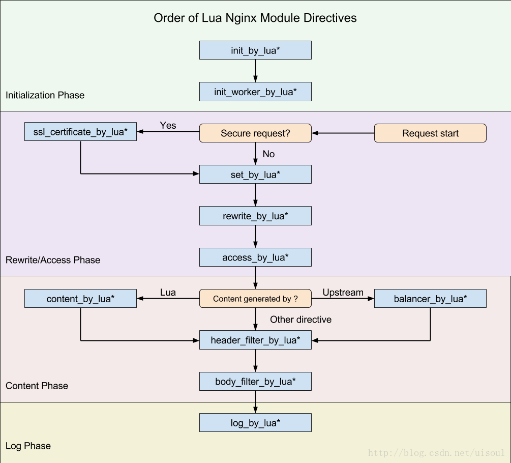

# ngx_lua模块

ngx_lua模块的原理：

1、每个worker（工作进程）创建一个Lua VM，worker内所有协程共享VM；
2、将Nginx I/O原语封装后注入 Lua VM，允许Lua代码直接访问；
3、每个外部请求都由一个Lua协程处理，协程之间数据隔离；
4、Lua代码调用I/O操作等异步接口时，会挂起当前协程（并保护上下文数据），而不阻塞worker；
5、I/O等异步操作完成时还原相关协程上下文数据，并继续运行；

 可以在nginx配置文件中加上目录：nginx.conf中server外层增加配置

```
lua_package_path   "/opt/golbal_lua/?.lua;/opt/now_project_lua/?.lua;;";
lua_package_cpath  "/opt/golbal_so/?.so;/opt/now_project_so/?.so;;";
```

Nginx 处理请求的过程一共划分为 11 个阶段，按照执行顺序依次是

```
{
post-read、[Nginx 读取并解析完请求头（request headers）之后就立即开始运行    
server-rewrite、[server请求地址重写阶段
find-config、[配置查找阶段，用来完成当前请求与location配置块配对
rewrite、[location请求地址重写阶段，当ngx_rewrite指令用于location中，就是再这个阶段运行的；
post-rewrite、[对rewrite阶段的多次重写 做一次内不跳转 到 find-config阶段

preaccess、[访问权限检查准备阶段
access、[权限检查阶段，ngx_access在这个阶段运行，配置指令多是执行访问控制相关的任务，如检查用户的访问权限，检查用户的来源IP是否合法
post-access、[主要用于配合 access 阶段实现标准 ngx_http_core 模块提供的配置指令 satisfy 的功能 访问权限检查提交阶段

try-files、[配置项try_files处理阶段
content、[内容产生阶段，是所有请求处理阶段中最为重要的阶段，因为这个阶段的指令通常是用来生成HTTP响应内容的
log、[日志模块处理阶段
}

rewrite、access 和 content 这三个最为常见的 Nginx 请求处理阶段

ngx.lua的运行阶段

init_by_lua            http
set_by_lua             server, server if, location, location if
rewrite_by_lua         http, server, location, location if
access_by_lua          http, server, location, location if
content_by_lua         location, location if
header_filter_by_lua   http, server, location, location if
body_filter_by_lua     http, server, location, location if
log_by_lua             http, server, location, location if

{
set_by_lua: 流程分支处理判断变量初始化
rewrite_by_lua: 转发、重定向、缓存等功能(例如特定请求代理到外网)
access_by_lua: IP准入、接口权限等情况集中处理(例如配合iptable完成简单防火墙)
content_by_lua: 内容生成
header_filter_by_lua: 应答HTTP过滤处理(例如添加头部信息)
body_filter_by_lua: 应答BODY过滤处理(例如完成应答内容统一成大写)
log_by_lua: 会话完成后本地异步完成日志记录(日志可以记录在本地，还可以同步到其他机器)
}


post-read:{
        set_real_ip_from 127.0.0.1;
        real_ip_header   X-My-IP;
        location /test {
           set $addr $remote_addr;
           echo "from: $addr";
           }

  ngx_realip 模块究竟有什么实际用途呢？为什么我们需要去改写请求的来源地址呢？答案是：当 Nginx 处理的请求经过了某个 HTTP 代理服务器的转发时，这个模块就变得特别有用。当原始的用户请求经过转发之后，Nginx 接收到的请求的来源地址无一例外地变成了该代理服务器的 IP 地址，于是 Nginx 以及 Nginx 背后的应用就无法知道原始请求的真实来源。所以，一般我们会在 Nginx 之前的代理服务器中把请求的原始来源地址编码进某个特殊的 HTTP 请求头中（例如上例中的 X-My-IP 请求头），然后再在 Nginx 一侧把这个请求头中编码的地址恢复出来。这样 Nginx 中的后续处理阶段（包括 Nginx 背后的各种后端应用）就会认为这些请求直接来自那些原始的地址，代理服务器就仿佛不存在一样。正是因为这个需求，所以 ngx_realip 模块才需要在第一个处理阶段，即 post-read 阶段，注册处理程序，以便尽可能早地改写请求的来源。
}
server-rewrite{
当 ngx_rewrite 模块的配置指令直接书写在 server 配置块中时，基本上都是运行在 server-rewrite 阶段;由于 server-rewrite 阶段位于 post-read 阶段之后，所以 server 配置块中的 set 指令也就总是运行在 ngx_realip 模块改写请求的来源地址之后。
}

find-config{
这个阶段并不支持 Nginx 模块注册处理程序，而是由 Nginx 核心来完成当前请求与 location 配置块之间的配对工作。换句话说，在此阶段之前，请求并没有与任何 location 配置块相关联。因此，对于运行在 find-config 阶段之前的 post-read 和 server-rewrite 阶段来说，只有 server 配置块以及更外层作用域中的配置指令才会起作用。这就是为什么只有写在 server 配置块中的 ngx_rewrite 模块的指令才会运行在 server-rewrite 阶段，这也是为什么前面所有例子中的 ngx_realip 模块的指令也都特意写在了 server 配置块中，以确保其注册在 post-read 阶段的处理程序能够生效。
}
rewrite{
    运行在 find-config 阶段之后的便是我们的老朋友 rewrite 阶段。由于 Nginx 已经在 find-config 阶段完成了当前请求与 location 的配对，所以从 rewrite 阶段开始，location 配置块中的指令便可以产生作用。当 ngx_rewrite 模块的指令用于 location 块中时，便是运行在这个 rewrite 阶段。另外， ngx_set_misc 模块的指令也是如此，还有 ngx_lua 模块的 set_by_lua 指令和 rewrite_by_lua(rewrite tail 晚于标准HttpRewriteModule之后) 指令也不例外。请注意在rewrite_by_lua内调用ngx.exit(ngx.OK)，nginx的请求处理流程将继续进行content阶段的处理。从rewrite_by_lua终止当前的请求，要调用ngx.exit返回status大于200并小于300的成功状态或ngx.exit(ngx.HTTP_INTERNAL_SERVER_ERROR)的失败状态。
}
post-rewrite{
    rewrite 阶段再往后便是所谓的 post-rewrite 阶段。这个阶段也像 find-config 阶段那样不接受 Nginx 模块注册处理程序，而是由 Nginx 核心完成 rewrite 阶段所要求的“内部跳转”操作（如果 rewrite 阶段有此要求的话）。“内部跳转”的工作原理,本质上其实就是把当前的请求处理阶段强行倒退到 find-config 阶段，以便重新进行请求 URI 与 location 配置块的配对,有趣的地方是，倒退回 find-config 阶段的动作并不是发生在 rewrite 阶段，而是发生在后面的 post-rewrite 阶段。目的为了在最初匹配的 location 块中支持多次反复地改写 URI。
{
    location /foo {
        rewrite ^ /bar;
        rewrite ^ /baz;
        echo foo;
    }
    location /bar {
        echo bar;
    }
    location /baz {
        echo baz;
    }
}
如果在 server 配置块中直接使用 rewrite 配置指令对请求 URI 进行改写，则不会涉及“内部跳转”，因为此时 URI 改写发生在 server-rewrite 阶段，早于执行 location 配对的 find-config 阶段。
}
preaccess{
    标准模块 ngx_limit_req 和 ngx_limit_zone 就运行在此阶段，前者可以控制请求的访问频度，而后者可以限制访问的并发度。前面反复提到的标准模块 ngx_realip 其实也在这个阶段注册了处理程序, 如果ngx_realip 的配置指令都写在了 location 配置块中，那么在 post-read 阶段，ngx_realip 模块的处理程序没有看到任何可用的配置信息，便不会执行来源地址的改写工作了。为了解决这个难题， ngx_realip 模块便又特意在 preaccess 阶段注册了处理程序，这样它才有机会运行 location 块中的配置指令，但是不同模块之间的执行顺序一般是不确定的，可能导致意外。
}
access{
    运行在 preaccess 阶段之后的则是我们的另一个老朋友，access 阶段。前面我们已经知道了，标准模块 ngx_access、第三方模块 ngx_auth_request 以及第三方模块 ngx_lua 的 access_by_lua(access tail 晚于标准HttpAccessModule之后 主要用于访问控制) 指令就运行在这个阶段。
}
post-access{
    access 阶段之后便是 post-access 阶段。从这个阶段的名字，我们也能一眼看出它是紧跟在 access 阶段后面执行的。这个阶段也和 post-rewrite 阶段类似，并不支持 Nginx 模块注册处理程序，而是由 Nginx 核心自己完成一些处理工作。post-access 阶段主要用于配合 access 阶段实现标准 ngx_http_core 模块提供的配置指令 satisfy 的功能。
    对于多个 Nginx 模块注册在 access 阶段的处理程序， satisfy 配置指令可以用于控制它们彼此之间的协作方式。比如模块 A 和 B 都在 access 阶段注册了与访问控制相关的处理程序，那就有两种协作方式，一是模块 A 和模块 B 都得通过验证才算通过，二是模块 A 和模块 B 只要其中任一个通过验证就算通过。第一种协作方式称为 all 方式（或者说“与关系”），第二种方式则被称为 any 方式（或者说“或关系”）。默认情况下，Nginx 使用的是 all 方式。
}
try-file{
    紧跟在 post-access 阶段之后的是 try-files 阶段。这个阶段专门用于实现标准配置指令 try_files 的功能，并不支持 Nginx 模块注册处理程序。
    指令接受两个以上任意数量的参数，每个参数都指定了一个 URI. 这里假设配置了 N 个参数，则 Nginx 会在 try-files 阶段，依次把前 N-1 个参数映射为文件系统上的对象（文件或者目录），然后检查这些对象是否存在。一旦 Nginx 发现某个文件系统对象存在，就会在 try-files 阶段把当前请求的 URI 改写为该对象所对应的参数 URI（但不会包含末尾的斜杠字符，也不会发生 “内部跳转”）。如果前 N-1 个参数所对应的文件系统对象都不存在，try-files 阶段就会立即发起“内部跳转”到最后一个参数（即第 N 个参数）所指定的 URI.
    对于 try_files 的前 N-1 个参数，Nginx 只会检查文件系统，而不会去执行 URI 与 location 之间的匹配。当 try_files 指令处理到它的最后一个参数时，总是直接执行“内部跳转”，而不论其对应的文件系统对象是否存在。但 try_files 会自动去除末尾的斜杠字符。
    通过前面这几组实验不难看到， try_files 指令本质上只是有条件地改写当前请求的 URI，而这里说的“条件”其实就是文件系统上的对象是否存在。当“条件”都不满足时，它就会无条件地发起一个指定的“内部跳转”。当然，除了无条件地发起“内部跳转”之外， try_files 指令还支持直接返回指定状态码的 HTTP 错误页，例如：
    try_files /foo /bar/ =404;#这行配置是说，当 /foo 和 /bar/ 参数所对应的文件系统对象都不存在时，就直接返回 404 Not Found 错误页。注意这里它是如何使用等号字符前缀来标识 HTTP 状态码的。
}

set 指令来自 ngx_rewrite 模块，运行于 rewrite 阶段；
rewrite_by_lua 指令来自 ngx_lua 模块，运行于 rewrite 阶段的末尾；
deny 指令来自 ngx_access 模块，运行于 access 阶段；
access_by_lua 指令同样来自 ngx_lua 模块，运行于 access 阶段的末尾；
echo 指令则来自 ngx_echo 模块，运行在 content 阶段。
content_by_lua 指令来自 ngx_lua 模块，运行于 content 阶段；不要将它和其它的内容处理指令在同一个location内使用如proxy_pass。
header_filter_by_lua 运行于 content 阶段output-header-filter 一般用来设置cookie和headers，在该阶段不能使用如下几个API：


{
    init_by_lua:
    在nginx重新加载配置文件时，运行里面lua脚本，常用于全局变量的申请。
    例如lua_shared_dict共享内存的申请，只有当nginx重起后，共享内存数据才清空，这常用于统计。

set_by_lua:
设置一个变量，常用与计算一个逻辑，然后返回结果
该阶段不能运行Output API、Control API、Subrequest API、Cosocket API

rewrite_by_lua:
在access阶段前运行，主要用于rewrite

access_by_lua:
主要用于访问控制，能收集到大部分变量，类似status需要在log阶段才有。
这条指令运行于nginx access阶段的末尾，因此总是在 allow 和 deny 这样的指令之后运行，虽然它们同属 access 阶段。

content_by_lua:
阶段是所有请求处理阶段中最为重要的一个，运行在这个阶段的配置指令一般都肩负着生成内容（content）并输出HTTP响应。

header_filter_by_lua:
一般只用于设置Cookie和Headers等
该阶段不能运行Output API、Control API、Subrequest API、Cosocket API

body_filter_by_lua:
一般会在一次请求中被调用多次, 因为这是实现基于 HTTP 1.1 chunked 编码的所谓“流式输出”的。
该阶段不能运行Output API、Control API、Subrequest API、Cosocket API

log_by_lua:
该阶段总是运行在请求结束的时候，用于请求的后续操作，如在共享内存中进行统计数据,如果要高精确的数据统计，应该使用body_filter_by_lua。
该阶段不能运行Output API、Control API、Subrequest API、Cosocket API
}


$arg_xxx URL参数变量组
$cookie_xxx cookie变量组
$http_xxx 请求头变量组
$send_http_xxx 响应头变量组
以上都是只读变量  如果修改可能造成意外错误
$args 可修改
```





**ngx_lua 模块提供的指令和API等：**

| 指令名称                                      | 说明                                                         |
| --------------------------------------------- | ------------------------------------------------------------ |
| lua_use_default_type                          | 是否使用default_type指令定义的Content-Type默认值             |
| lua_code_cache                                | *_by_lua_file文件是否cache                                   |
| lua_regex_cache_max_entries                   |                                                              |
| lua_regex_match_limit                         |                                                              |
| lua_package_path                              | 用Lua写的lua外部库路径（.lua文件）                           |
| lua_package_cpath                             | 用C写的lua外部库路径（.so文件）                              |
| init_by_lua                                   | master进程启动时挂载的lua代码                                |
| init_by_lua_file                              |                                                              |
| init_worker_by_lua                            | worker进程启动时挂载的lua代码，常用来执行一些定时器任务      |
| init_worker_by_lua_file                       |                                                              |
| set_by_lua                                    | 设置变量                                                     |
| set_by_lua_file                               |                                                              |
| content_by_lua                                | handler模块                                                  |
| content_by_lua_file                           |                                                              |
| rewrite_by_lua                                |                                                              |
| rewrite_by_lua_file                           |                                                              |
| access_by_lua                                 |                                                              |
| access_by_lua_file                            |                                                              |
| header_filter_by_lua                          | header filter模块                                            |
| header_filter_by_lua_file                     |                                                              |
| body_filter_by_lua                            | body filter模块，ngx.arg[1]代表输入的chunk，ngx.arg[2]代表当前chunk是否为last |
| body_filter_by_lua_file                       |                                                              |
| log_by_lua                                    |                                                              |
| log_by_lua_file                               |                                                              |
| lua_need_request_body                         | 是否读请求体，跟ngx.req.read_body()函数作用类似              |
| lua_shared_dict                               | 创建全局共享的table（多个worker进程共享）                    |
| lua_socket_connect_timeout                    | TCP/unix 域socket对象connect方法的超时时间                   |
| lua_socket_send_timeout                       | TCP/unix 域socket对象send方法的超时时间                      |
| lua_socket_send_lowat                         | 设置cosocket send buffer的low water值                        |
| lua_socket_read_timeout                       | TCP/unix 域socket对象receive方法的超时时间                   |
| lua_socket_buffer_size                        | cosocket读buffer大小                                         |
| lua_socket_pool_size                          | cosocket连接池大小                                           |
| lua_socket_keepalive_timeout                  | cosocket长连接超时时间                                       |
| lua_socket_log_errors                         | 是否打开cosocket错误日志                                     |
| lua_ssl_ciphers                               |                                                              |
| lua_ssl_crl                                   |                                                              |
| lua_ssl_protocols                             |                                                              |
| lua_ssl_trusted_certificate                   |                                                              |
| lua_ssl_verify_depth                          |                                                              |
| lua_http10_buffering                          |                                                              |
| rewrite_by_lua_no_postpone                    |                                                              |
| lua_transform_underscores_in_response_headers |                                                              |
| lua_check_client_abort                        | 是否监视client提前关闭请求的事件，如果打开监视，会调用ngx.on_abort()注册的回调 |
| lua_max_pending_timers                        |                                                              |
| lua_max_running_timers                        |                                                              |

 

 

 

| table                         | 说明                                                 |
| ----------------------------- | ---------------------------------------------------- |
| ngx.arg                       | 指令参数，如跟在content_by_lua_file后面的参数        |
| ngx.var                       | 变量，ngx.var.VARIABLE引用某个变量                   |
| ngx.ctx                       | 请求的lua上下文                                      |
| ngx.header                    | 响应头，ngx.header.HEADER引用某个头                  |
| ngx.status                    | 响应码                                               |
|                               |                                                      |
| API                           | 说明                                                 |
| ngx.log                       | 输出到error.log                                      |
| print                         | 等价于 ngx.log(ngx.NOTICE, ...)                      |
| ngx.send_headers              | 发送响应头                                           |
| ngx.headers_sent              | 响应头是否已发送                                     |
| ngx.resp.get_headers          | 获取响应头                                           |
| ngx.timer.at                  | 注册定时器事件                                       |
| ngx.is_subrequest             | 当前请求是否是子请求                                 |
| ngx.location.capture          | 发布一个子请求                                       |
| ngx.location.capture_multi    | 发布多个子请求                                       |
| ngx.exec                      |                                                      |
| ngx.redirect                  |                                                      |
| ngx.print                     | 输出响应                                             |
| ngx.say                       | 输出响应，自动添加'\n'                               |
| ngx.flush                     | 刷新响应                                             |
| ngx.exit                      | 结束请求                                             |
| ngx.eof                       |                                                      |
| ngx.sleep                     | 无阻塞的休眠（使用定时器实现）                       |
| ngx.get_phase                 |                                                      |
| ngx.on_abort                  | 注册client断开请求时的回调函数                       |
| ndk.set_var.DIRECTIVE         |                                                      |
| ngx.req.start_time            | 请求的开始时间                                       |
| ngx.req.http_version          | 请求的HTTP版本号                                     |
| ngx.req.raw_header            | 请求头（包括请求行）                                 |
| ngx.req.get_method            | 请求方法                                             |
| ngx.req.set_method            | 请求方法重载                                         |
| ngx.req.set_uri               | 请求URL重写                                          |
| ngx.req.set_uri_args          |                                                      |
| ngx.req.get_uri_args          | 获取请求参数                                         |
| ngx.req.get_post_args         | 获取请求表单                                         |
| ngx.req.get_headers           | 获取请求头                                           |
| ngx.req.set_header            |                                                      |
| ngx.req.clear_header          |                                                      |
| ngx.req.read_body             | 读取请求体                                           |
| ngx.req.discard_body          | 扔掉请求体                                           |
| ngx.req.get_body_data         |                                                      |
| ngx.req.get_body_file         |                                                      |
| ngx.req.set_body_data         |                                                      |
| ngx.req.set_body_file         |                                                      |
| ngx.req.init_body             |                                                      |
| ngx.req.append_body           |                                                      |
| ngx.req.finish_body           |                                                      |
| ngx.req.socket                |                                                      |
| ngx.escape_uri                | 字符串的url编码                                      |
| ngx.unescape_uri              | 字符串url解码                                        |
| ngx.encode_args               | 将table编码为一个参数字符串                          |
| ngx.decode_args               | 将参数字符串编码为一个table                          |
| ngx.encode_base64             | 字符串的base64编码                                   |
| ngx.decode_base64             | 字符串的base64解码                                   |
| ngx.crc32_short               | 字符串的crs32_short哈希                              |
| ngx.crc32_long                | 字符串的crs32_long哈希                               |
| ngx.hmac_sha1                 | 字符串的hmac_sha1哈希                                |
| ngx.md5                       | 返回16进制MD5                                        |
| ngx.md5_bin                   | 返回2进制MD5                                         |
| ngx.sha1_bin                  | 返回2进制sha1哈希值                                  |
| ngx.quote_sql_str             | SQL语句转义                                          |
| ngx.today                     | 返回当前日期                                         |
| ngx.time                      | 返回UNIX时间戳                                       |
| ngx.now                       | 返回当前时间                                         |
| ngx.update_time               | 刷新时间后再返回                                     |
| ngx.localtime                 |                                                      |
| ngx.utctime                   |                                                      |
| ngx.cookie_time               | 返回的时间可用于cookie值                             |
| ngx.http_time                 | 返回的时间可用于HTTP头                               |
| ngx.parse_http_time           | 解析HTTP头的时间                                     |
| ngx.re.match                  |                                                      |
| ngx.re.find                   |                                                      |
| ngx.re.gmatch                 |                                                      |
| ngx.re.sub                    |                                                      |
| ngx.re.gsub                   |                                                      |
| ngx.shared.DICT               |                                                      |
| ngx.shared.DICT.get           |                                                      |
| ngx.shared.DICT.get_stale     |                                                      |
| ngx.shared.DICT.set           |                                                      |
| ngx.shared.DICT.safe_set      |                                                      |
| ngx.shared.DICT.add           |                                                      |
| ngx.shared.DICT.safe_add      |                                                      |
| ngx.shared.DICT.replace       |                                                      |
| ngx.shared.DICT.delete        |                                                      |
| ngx.shared.DICT.incr          |                                                      |
| ngx.shared.DICT.flush_all     |                                                      |
| ngx.shared.DICT.flush_expired |                                                      |
| ngx.shared.DICT.get_keys      |                                                      |
| ngx.socket.udp                |                                                      |
| udpsock:setpeername           |                                                      |
| udpsock:send                  |                                                      |
| udpsock:receive               |                                                      |
| udpsock:close                 |                                                      |
| udpsock:settimeout            |                                                      |
| ngx.socket.tcp                |                                                      |
| tcpsock:connect               |                                                      |
| tcpsock:sslhandshake          |                                                      |
| tcpsock:send                  |                                                      |
| tcpsock:receive               |                                                      |
| tcpsock:receiveuntil          |                                                      |
| tcpsock:close                 |                                                      |
| tcpsock:settimeout            |                                                      |
| tcpsock:setoption             |                                                      |
| tcpsock:setkeepalive          |                                                      |
| tcpsock:getreusedtimes        |                                                      |
| ngx.socket.connect            |                                                      |
| ngx.thread.spawn              |                                                      |
| ngx.thread.wait               |                                                      |
| ngx.thread.kill               |                                                      |
| coroutine.create              |                                                      |
| coroutine.resume              |                                                      |
| coroutine.yield               |                                                      |
| coroutine.wrap                |                                                      |
| coroutine.running             |                                                      |
| coroutine.status              |                                                      |
| ngx.config.debug              | 编译时是否有 --with-debug选项                        |
| ngx.config.prefix             | 编译时的 --prefix选项                                |
| ngx.config.nginx_version      | 返回nginx版本号                                      |
| ngx.config.nginx_configure    | 返回编译时 ./configure的命令行选项                   |
| ngx.config.ngx_lua_version    | 返回ngx_lua模块版本号                                |
| ngx.worker.exiting            | 当前worker进程是否正在关闭（如reload、shutdown期间） |
| ngx.worker.pid                | 返回当前worker进程的pid                              |


| 常量                      | 说明                                                         |
| ------------------------- | ------------------------------------------------------------ |
| Core constants            | ngx.OK (0)<br/>ngx.ERROR (-1)<br/>ngx.AGAIN (-2)<br/>ngx.DONE (-4)<br/>ngx.DECLINED (-5)<br/>ngx.nil |
| HTTP method constants     | ngx.HTTP_GET<br/>ngx.HTTP_HEAD<br/>ngx.HTTP_PUT<br/>ngx.HTTP_POST<br/>ngx.HTTP_DELETE<br/>ngx.HTTP_OPTIONS  <br/>ngx.HTTP_MKCOL    <br/>ngx.HTTP_COPY      <br/>ngx.HTTP_MOVE     <br/>ngx.HTTP_PROPFIND <br/>ngx.HTTP_PROPPATCH <br/>ngx.HTTP_LOCK <br/>ngx.HTTP_UNLOCK    <br/>ngx.HTTP_PATCH   <br/>ngx.HTTP_TRACE |
| HTTP status constants     | ngx.HTTP_OK (200)<br/>ngx.HTTP_CREATED (201)<br/>ngx.HTTP_SPECIAL_RESPONSE (300)<br/>ngx.HTTP_MOVED_PERMANENTLY (301)<br/>ngx.HTTP_MOVED_TEMPORARILY (302)<br/>ngx.HTTP_SEE_OTHER (303)<br/>ngx.HTTP_NOT_MODIFIED (304)<br/>ngx.HTTP_BAD_REQUEST (400)<br/>ngx.HTTP_UNAUTHORIZED (401)<br/>ngx.HTTP_FORBIDDEN (403)<br/>ngx.HTTP_NOT_FOUND (404)<br/>ngx.HTTP_NOT_ALLOWED (405)<br/>ngx.HTTP_GONE (410)<br/>ngx.HTTP_INTERNAL_SERVER_ERROR (500)<br/>ngx.HTTP_METHOD_NOT_IMPLEMENTED (501)<br/>ngx.HTTP_SERVICE_UNAVAILABLE (503)<br/>ngx.HTTP_GATEWAY_TIMEOUT (504) |
| Nginx log level constants | ngx.STDERR<br/>ngx.EMERG<br/>ngx.ALERT<br/>ngx.CRIT<br/>ngx.ERR<br/>ngx.WARN<br/>ngx.NOTICE<br/>ngx.INFO<br/>ngx.DEBUG |

